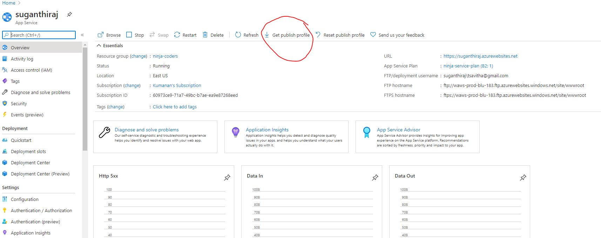

# How to create a CI/CD for an Express JS website in Azure

## 1. Create an Express JS Website in your local machine.

###     a. install expressjs generator

```
    npm install -g express-generator
```

### b. create a express generator website

```
    //create an empty directory and cd into the that directory
    
    mkdir express-labs
    cd express-labs

    // create express js website with no view engine.
    express --no-view
    //
```

## 2. Push the expressjs website into github repository

## 3. Get the publish profile from your azure website.

 ### a. Azure publish profile will have an extension ***.PublishSettings***
> Publish profile has all the instructions to upload your website to azure.



## 4. Create a secret variable in your project in github.com

  ### a. The name of the secret variable should be  ***AZURE_WEBAPP_PUBLISH_PROFILE***
  ### b. copy the contents of the publish settings that you downloaded in the previous step and paste in the value field of the github secret


## 5. Create a new Github action 


### Create a new workflow


```
name: Deploy Node.js to Azure Web App

on:
  [push]

# CONFIGURATION
# For help, go to https://github.com/Azure/Actions
#
# 1. Set up the following secrets in your repository:
#   AZURE_WEBAPP_PUBLISH_PROFILE
#
# 2. Change these variables for your configuration:
env:
  AZURE_WEBAPP_NAME: jslabs    # set this to your application's name
  AZURE_WEBAPP_PACKAGE_PATH: '.'      # set this to the path to your web app project, defaults to the repository root
  NODE_VERSION: '12.x'                # set this to the node version to use

jobs:
  build-and-deploy:
    name: Build and Deploy
    runs-on: ubuntu-latest
    steps:
    - uses: actions/checkout@master
    - name: Use Node.js ${{ env.NODE_VERSION }}
      uses: actions/setup-node@v1
      with:
        node-version: ${{ env.NODE_VERSION }}
    - name: npm install, build, and test
      run: |
        # Build and test the project, then
        # deploy to Azure Web App.
        npm install
        npm run build --if-present
        npm run test --if-present
    - name: 'Deploy to Azure WebApp'
      uses: azure/webapps-deploy@v2
      with: 
        app-name: ${{ env.AZURE_WEBAPP_NAME }}
        publish-profile: ${{ secrets.AZURE_WEBAPP_PUBLISH_PROFILE }}
        package: ${{ env.AZURE_WEBAPP_PACKAGE_PATH }}
        
  # For more information on GitHub Actions for Azure, refer to https://github.com/Azure/Actions
  # For more samples to get started with GitHub Action workflows to deploy to Azure, refer to https://github.com/Azure/actions-workflow-samples```


